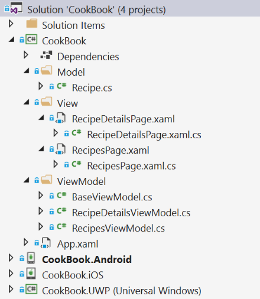
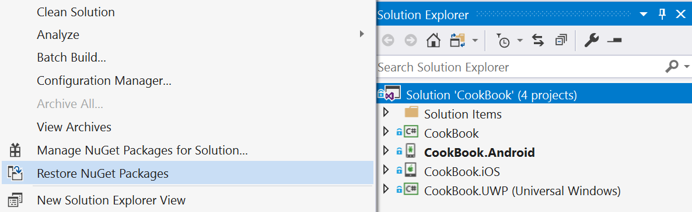
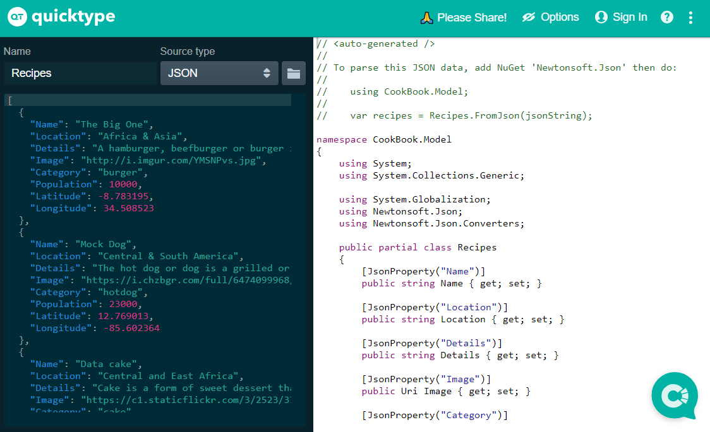
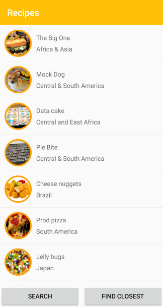

# Xamarin CookBook - Hands On Lab

This labs is free adaptation of the amazing Monkey lab from James Montemagno !
https://github.com/jamesmontemagno/MonkeysApp-Workshop

Today we will build a [Xamarin.Forms](https://docs.microsoft.com/xamarin/) application that will display a list of Recipes from around the world. We will start by building the business logic backend that pulls down json-encoded data from a RESTful endpoint. We will then leverage [Xamarin.Essentials](https://docs.microsoft.com/xamarin/essentials/index) to find the closest recipe to us and also show the recipe on a map. 

## Setup Guide
Follow our simple [setup guide](https://github.com/xamarin/dev-days-labs/raw/master/Xamarin%20Workshop%20Setup.pdf) to ensure you have Visual Studio and Xamarin setup and ready to deploy.

## Mobile App Walkthrough

### 1. Open Solution in Visual Studio

1. Open **Start/CookBook.sln**

This CookBookApp contains 4 projects

* CookBook  - Shared .NET Standard project that will have all shared code (models, views, view models)
* CookBook.Android - Xamarin.Android application
* CookBook.iOS - Xamarin.iOS application (requires a macOS build host)
* CookBook.UWP - Windows 10 UWP application (requires Visual Studio /2017 on Windows 10)



The **CookBook** project also has blank code files and XAML pages that we will use during the Hands on Lab. All of the code that we modify will be in this project for the workshop.

### 2. NuGet Restore

All projects have the required NuGet packages already installed, so there will be no need to install additional packages during the Hands on Lab. The first thing that we must do is restore all of the NuGet packages from the internet.

1. **Right-click** on the **Solution** and selecting **Restore NuGet packages...**



### 3. Model

We will download details about the recipe and will need a class to represent it.

We can easily convert our json file located at [croustipeze.com/ressources/recipesdata.json]("http://www.croustipeze.com/ressources/recipesdata.json") by using [quicktype.io](https://app.quicktype.io/) and pasting the raw json into quicktype to generate our C# classes. Ensure that you set the Name to `Recipe` and the generated namespace to `CookBook.Model` and select C#. Here is a direct URL to the code: [https://app.quicktype.io?share=W43y1rUvk1FBQa5RsBC0](https://app.quicktype.io?share=W43y1rUvk1FBQa5RsBC0)



1. Open `Model/Recipe.cs`
2. In `Recipe.cs`, copy/paste the following:

```csharp
public partial class Recipe
{
    [JsonProperty("Name")]
    public string Name { get; set; }

    [JsonProperty("Location")]
    public string Location { get; set; }

    [JsonProperty("Details")]
    public string Details { get; set; }

    [JsonProperty("Image")]
    public Uri Image { get; set; }

    [JsonProperty("Population")]
    public long Population { get; set; }

    [JsonProperty("Latitude")]
    public double Latitude { get; set; }

    [JsonProperty("Longitude")]
    public double Longitude { get; set; }
}

internal static class Converter
{
    public static readonly JsonSerializerSettings Settings = new JsonSerializerSettings
    {
        MetadataPropertyHandling = MetadataPropertyHandling.Ignore,
        DateParseHandling = DateParseHandling.None,
        Converters =
        {
            new IsoDateTimeConverter { DateTimeStyles = DateTimeStyles.AssumeUniversal }
        },
    };
}
```

### 4. Implementing INotifyPropertyChanged

*INotifyPropertyChanged* is important for data binding in MVVM Frameworks. This is an interface that, when implemented, lets our view know about changes to the model. We will implement it once in our `BaseViewModel` so all other view models that we can create can inherit from it.

1. In Visual Studio, open `ViewModel/BaseViewModel.cs`
2. In `BaseViewModel.cs`, implement INotifyPropertyChanged by changing this

```csharp
public class BaseViewModel
{

}
```

to this

```csharp
public class BaseViewModel : INotifyPropertyChanged
{

}
```

3. In `BaseViewModel.cs`, right click on `INotifyPropertyChanged`
4. Implement the `INotifyPropertyChanged` Interface
   - (Visual Studio Mac) In the right-click menu, select Quick Fix -> Implement Interface
   - (Visual Studio PC) In the right-click menu, select Quick Actions and Refactorings -> Implement Interface
5. In `BaseViewModel.cs`, ensure this line of code now appears:

```csharp
public event PropertyChangedEventHandler PropertyChanged;
```

6. In `BaseViewModel.cs`, create a new method called `OnPropertyChanged`
    - Note: We will call `OnPropertyChanged` whenever a property updates

```csharp
public void OnPropertyChanged([CallerMemberName] string propertyName = "")
{
    PropertyChanged?.Invoke(this, new PropertyChangedEventArgs(propertyName));
}
```

### 5. Implementing Title, IsBusy, and IsNotBusy

We will create a backing field and accessors for a few properties. These properties will allow us to set the title on our pages and also let our view know that our view model is busy so we don't perform duplicate operations (like allowing the user to refresh the data multiple times). They are in the `BaseViewModel` because they are common for every page.

1. In `BaseViewModel.cs`, create the following properties:

```csharp
public class BaseViewModel : INotifyPropertyChanged
{
    private string _title;
    public string Title
    {
        get => _title;
        set
        {
            _title = value;
        }
    }

    private bool _isBusy;
    public bool IsBusy
    {
        get => _isBusy;
        set
        {
            _isBusy = value;
        }
    }
    //...
}
```

2. Add a constructor with a title parameter :

```csharp
public class BaseViewModel : INotifyPropertyChanged
{
    //...
    public BaseViewModel(string title)
    {
        Title = title;
    }
    //...
}
```

3. Add OnPropertyChanged to the properties:

```csharp
public class BaseViewModel : INotifyPropertyChanged
{
    private string _title;
    public string Title
    {
        get => _title;
        set
        {
            if (_title == value)
                return;
                
            _title = value;
            
            OnPropertyChanged();
        }
    }
    
    private bool _isBusy;
    public bool IsBusy
    {
        get => _isBusy;
        set
        {
            if (_isBusy == value)
                return;
                
            _isBusy = value;
            
            OnPropertyChanged();
        }
    }
    //...
}
```

Notice that we call `OnPropertyChanged` when the value changes. The Xamarin.Forms binding infrastructure will subscribe to our **PropertyChanged** event so the UI will be notified of the change.

We can also create the inverse of `IsBusy` by creating another property called `IsNotBusy` that returns the opposite of `IsBusy` and then raising the event of `OnPropertyChanged` when we set `IsBusy`

```csharp
public class BaseViewModel : INotifyPropertyChanged
{
    //...
    private bool _isBusy;
    public bool IsBusy
    {
        get => _isBusy;
        set
        {
            if (_isBusy == value)
                return;
                
            _isBusy = value;
            
            OnPropertyChanged();
            OnPropertyChanged(nameof(IsNotBusy));
        }
    } 

    public bool IsNotBusy => !IsBusy;
    //...
}
```

### 6. Add a HttpClient in BaseViewModel

To simplify the internet interactions, we will add these following lines inside our **BaseViewModel** :

```csharp
public class BaseViewModel : INotifyPropertyChanged
{
    //...
    private HttpClient _httpClient;
    protected HttpClient Client => _httpClient ?? (_httpClient = new HttpClient());
    //...
}
```

`Client` property will be used by our view models to retrieve data from the internet.

### 7. Create ObservableCollection of Recipes

We will use an `ObservableCollection<Recipe>` that will be cleared and then loaded with **Recipe** objects. We use an `ObservableCollection` because it has built-in support to raise `CollectionChanged` events when we Add or Remove items from the collection. This means we don't call `OnPropertyChanged` when updating the collection.

1. In `RecipesViewModel.cs` declare an auto-property which we will initialize to an empty collection. Also, we can set our view model Title to `Recipes` using base constructor.

```csharp
public class RecipesViewModel : BaseViewModel
{
    public ObservableCollection<Recipe> Recipes { get; }
    
    public RecipesViewModel() : base(title: "Recipes")
    {
        Recipes = new ObservableCollection<Recipe>();
    }
}
```

### 8. Get Recipes from the internet

We are ready to retrieve the recipe data from the internet. We will not use DependencyService here to keep it simple.

1. In `RecipesViewModel.cs`, create a method named `GetRecipesAsync` with that returns `async Task`:

```csharp
public class RecipesViewModel : BaseViewModel
{
    //...
    private async Task GetRecipesAsync()
    {
    
    }
    //...
}
```

2. In `GetRecipesAsync`, first ensure `IsBusy` is false. If it is true, `return`

```csharp
private async Task GetRecipesAsync()
{
    if (IsBusy)
        return;
}
```

3. In `GetRecipesAsync`, add some scaffolding for try/catch/finally blocks
    - Notice, that we toggle *IsBusy* to true and then false when we start to call to the server and when we finish.

```csharp
private async Task GetRecipesAsync()
{
    if (IsBusy)
        return;

    IsBusy = true;
    
    try
    {
        

    }
    catch (Exception ex)
    {

    }
    finally
    {
       IsBusy = false;
    }
}
```

4. In the `try` block of `GetRecipesAsync`, we will get the recipes using the HttpClient (Client) in our BaseViewModel class.
To get the data from our server and parse it is actually extremely easy by leveraging `HttpClient` and `Json.NET`.

```csharp
private async Task GetRecipesAsync()
{
    ...
    try
    {
        string jsonRecipes = await Client.GetStringAsync("http://www.croustipeze.com/ressources/recipesdata.json");
        Recipe[] recipes = JsonConvert.DeserializeObject<Recipe[]>(jsonRecipes, Converter.Settings);
    }
    ... 
}
```

5. Inside of the `try`, clear the `Recipes` property and then add the new recipe data:

```csharp
private async Task GetRecipesAsync()
{
    //...
    try
    {
        string jsonRecipes = await Client.GetStringAsync("http://www.croustipeze.com/ressources/recipesdata.json");
        Recipe[] recipes = JsonConvert.DeserializeObject<Recipe[]>(jsonRecipes, Converter.Settings);

        Recipes.Clear();
        foreach (var recipe in recipes)
            Recipes.Add(recipe);
    }
    //...
}
```

6. In `GetRecipesAsync`, add this code to the `catch` block to display a popup if the data retrieval fails:

```csharp
private async Task GetRecipesAsync()
{
    //...
    catch(Exception ex)
    {
        Debug.WriteLine($"Unable to get recipes: {ex.Message}");
        await Application.Current.RecipesPage.DisplayAlert("Error!", ex.Message, "OK");
    }
    //...
}
```

7. Ensure the completed code looks like this:

```csharp
private async Task GetRecipesAsync()
{
    if (IsBusy)
        return;

    IsBusy = true;

    try
    {
        string jsonRecipes = await Client.GetStringAsync("http://www.croustipeze.com/ressources/recipesdata.json");
        Recipe[] recipes = JsonConvert.DeserializeObject<Recipe[]>(jsonRecipes, Converter.Settings);

        Recipes.Clear();
        foreach (var recipe in recipes)
            Recipes.Add(recipe);
    }
    catch (Exception ex)
    {
        Debug.WriteLine($"Unable to get recipes: {ex.Message}");
        await Application.Current.MainPage.DisplayAlert("Error!", ex.Message, "OK");
    }
    finally
    {
        IsBusy = false;
    }
}
```

Our main method for getting data is now complete!

#### 9. Create GetRecipes Command

Instead of invoking this method directly, we will expose it with a `Command`. A `Command` has an interface that knows what method to invoke and has an optional way of describing if the Command is enabled.

1. In `RecipesViewModel.cs`, create a new Command called `GetRecipesCommand`:

```csharp
public class RecipesViewModel : BaseViewModel
{
    //...
    public Command GetRecipesCommand { get; }
    //...
}
```

2. Inside of the `RecipesViewModel` constructor, create the `GetRecipesCommand` and pass it two methods
    - One to invoke when the command is executed
    - Another that determines if the command is enabled. Both methods can be implemented as lambda expressions as shown below:

```csharp
public class RecipesViewModel : BaseViewModel
{
    //...
    public RecipesViewModel()
    {
        //...
        GetRecipesCommand = new Command(async () => await GetRecipesAsync());
    }
    //...
}
```

## 10. Build The Recipes User Interface
It is now time to build the Xamarin.Forms user interface in `View/RecipesPage.xaml`. Our end result is to build a page that looks like this:



1. In `RecipesPage.xaml`, add a `BindingContext` between the `ContentPage` tags, which will enable us to get binding intellisense:

```xml
<?xml version="1.0" encoding="utf-8" ?>
<ContentPage xmlns="http://xamarin.com/schemas/2014/forms"
             xmlns:x="http://schemas.microsoft.com/winfx/2009/xaml"
             xmlns:viewmodel="clr-namespace:CookBook.ViewModel"
             xmlns:circle="clr-namespace:ImageCircle.Forms.Plugin.Abstractions;assembly=ImageCircle.Forms.Plugin"
             xmlns:ios="clr-namespace:Xamarin.Forms.PlatformConfiguration.iOSSpecific;assembly=Xamarin.Forms.Core"
             x:Class="CookBook.View.RecipesPage">

    <ContentPage.BindingContext>
        <viewmodel:RecipesViewModel/>
    </ContentPage.BindingContext>

</ContentPage>
```

2. We can create our first binding on the `ContentPage` by adding the `Title` Property:

```xml
<?xml version="1.0" encoding="utf-8" ?>
<ContentPage xmlns="http://xamarin.com/schemas/2014/forms"
             xmlns:x="http://schemas.microsoft.com/winfx/2009/xaml"
             xmlns:local="clr-namespace:CookBook"
             xmlns:viewmodel="clr-namespace:CookBook.ViewModel"
             xmlns:circle="clr-namespace:ImageCircle.Forms.Plugin.Abstractions;assembly=ImageCircle.Forms.Plugin"
             x:Class="CookBook.View.RecipesPage"
             Title="{Binding Title}"> <!-- Add this -->

    <ContentPage.BindingContext>
        <viewmodel:RecipesViewModel/>
    </ContentPage.BindingContext>

</ContentPage>
```

2. In the `RecipesPage.xaml`, we can add a `Grid` between the `ContentPage` tags with 2 rows and 2 columns. We will also set the `RowSpacing` and `ColumnSpacing` to

```xml
<?xml version="1.0" encoding="utf-8" ?>
<ContentPage xmlns="http://xamarin.com/schemas/2014/forms"
             xmlns:x="http://schemas.microsoft.com/winfx/2009/xaml"
             xmlns:local="clr-namespace:CookBook"
             xmlns:viewmodel="clr-namespace:CookBook.ViewModel"
             xmlns:circle="clr-namespace:ImageCircle.Forms.Plugin.Abstractions;assembly=ImageCircle.Forms.Plugin"
             x:Class="CookBook.View.RecipesPage"
             Title="{Binding Title}">

    <ContentPage.BindingContext>
        <viewmodel:RecipesViewModel/>
    </ContentPage.BindingContext>

    <!-- Add this -->
    <Grid 
        RowSpacing="0"
        ColumnSpacing="5" 
        CompressedLayout.IsHeadless="True">

        <Grid.RowDefinitions>
            <RowDefinition Height="*"/>
            <RowDefinition Height="Auto"/>
        </Grid.RowDefinitions>

        <Grid.ColumnDefinitions>
            <ColumnDefinition Width="*"/>
            <ColumnDefinition Width="*"/>
        </Grid.ColumnDefinitions>
        
    </Grid>
</ContentPage>
```

3. In the `RecipesPage.xaml`, we can add a `ListView` between the `Grid` tags that spans 2 Columns. We will also set the `ItemsSource` which will bind to our `Recipes` ObservableCollection and additionally set a few properties for optimizing the list.

```xml
<?xml version="1.0" encoding="utf-8" ?>
<ContentPage xmlns="http://xamarin.com/schemas/2014/forms"
             xmlns:x="http://schemas.microsoft.com/winfx/2009/xaml"
             xmlns:local="clr-namespace:CookBook"
             xmlns:viewmodel="clr-namespace:CookBook.ViewModel"
             xmlns:circle="clr-namespace:ImageCircle.Forms.Plugin.Abstractions;assembly=ImageCircle.Forms.Plugin"
             x:Class="CookBook.View.RecipesPage"
             Title="{Binding Title}">

    <ContentPage.BindingContext>
        <viewmodel:RecipesViewModel/>
    </ContentPage.BindingContext>

    <Grid 
        RowSpacing="0"
        ColumnSpacing="5" 
        CompressedLayout.IsHeadless="True">

        <Grid.RowDefinitions>
            <RowDefinition Height="*"/>
            <RowDefinition Height="Auto"/>
        </Grid.RowDefinitions>

        <Grid.ColumnDefinitions>
            <ColumnDefinition Width="*"/>
            <ColumnDefinition Width="*"/>
        </Grid.ColumnDefinitions>

        <!-- Add this -->
        <ListView 
            Grid.Row="0"
            Grid.Column="0"
            Grid.ColumnSpan="2"
            ItemsSource="{Binding Recipes}"
            HasUnevenRows="True"
            CachingStrategy="RecycleElement">
            
        </ListView>
    </Grid>
</ContentPage>
```

4. In the `RecipesPage.xaml`, we can add a `ItemTemplate` to our `ListView` that will represent what each item in the list displays:

```xml
<?xml version="1.0" encoding="utf-8" ?>
<ContentPage xmlns="http://xamarin.com/schemas/2014/forms"
             xmlns:x="http://schemas.microsoft.com/winfx/2009/xaml"
             xmlns:local="clr-namespace:CookBook"
             xmlns:viewmodel="clr-namespace:CookBook.ViewModel"
             xmlns:circle="clr-namespace:ImageCircle.Forms.Plugin.Abstractions;assembly=ImageCircle.Forms.Plugin"
             x:Class="CookBook.View.RecipesPage"
             Title="{Binding Title}">

    <ContentPage.BindingContext>
        <viewmodel:RecipesViewModel/>
    </ContentPage.BindingContext>

    <Grid 
        RowSpacing="0"
        ColumnSpacing="5" 
        CompressedLayout.IsHeadless="True">

        <Grid.RowDefinitions>
            <RowDefinition Height="*"/>
            <RowDefinition Height="Auto"/>
        </Grid.RowDefinitions>

        <Grid.ColumnDefinitions>
            <ColumnDefinition Width="*"/>
            <ColumnDefinition Width="*"/>
        </Grid.ColumnDefinitions>

        <ListView 
            Grid.Row="0"
            Grid.Column="0"
            Grid.ColumnSpan="2"
            ItemsSource="{Binding Recipes}"
            HasUnevenRows="True"
            CachingStrategy="RecycleElement">

            <!-- Add this -->
            <ListView.ItemTemplate>
                <DataTemplate>
                    <ViewCell>
                        <Grid 
                            ColumnSpacing="10" 
                            Padding="10">
                            
                            <Grid.ColumnDefinitions>
                                <ColumnDefinition Width="60"/>
                                <ColumnDefinition Width="*"/>
                            </Grid.ColumnDefinitions>

                            <Image 
                                Source="{Binding Image}"
                                Aspect="AspectFill"
                                WidthRequest="60"
                                HeightRequest="60"
                                HorizontalOptions="Center"
                                VerticalOptions="Center"/>
                            
                            <StackLayout 
                                Grid.Column="1"
                                VerticalOptions="Center">

                                <Label Text="{Binding Name}"/>
                                <Label Text="{Binding Location}"/>
                            </StackLayout>
                        </Grid>
                    </ViewCell>
                </DataTemplate>
            </ListView.ItemTemplate>
        </ListView>
    </Grid>
</ContentPage>
```

5. In the `RecipesPage.xaml`, we can add a `Button` under our `ListView` that will enable us to click it  and get the recipes from the server :

```xml
<?xml version="1.0" encoding="utf-8" ?>
<ContentPage xmlns="http://xamarin.com/schemas/2014/forms"
             xmlns:x="http://schemas.microsoft.com/winfx/2009/xaml"
             xmlns:local="clr-namespace:CookBook"
             xmlns:viewmodel="clr-namespace:CookBook.ViewModel"
             xmlns:circle="clr-namespace:ImageCircle.Forms.Plugin.Abstractions;assembly=ImageCircle.Forms.Plugin"
             x:Class="CookBook.View.RecipesPage"
             Title="{Binding Title}">

    <ContentPage.BindingContext>
        <viewmodel:RecipesViewModel/>
    </ContentPage.BindingContext>
    
    <Grid 
        RowSpacing="0"
        ColumnSpacing="5" 
        CompressedLayout.IsHeadless="True">

        <Grid.RowDefinitions>
            <RowDefinition Height="*"/>
            <RowDefinition Height="Auto"/>
        </Grid.RowDefinitions>

        <Grid.ColumnDefinitions>
            <ColumnDefinition Width="*"/>
            <ColumnDefinition Width="*"/>
        </Grid.ColumnDefinitions>

        <ListView 
            Grid.Row="0"
            Grid.Column="0"
            Grid.ColumnSpan="2"
            ItemsSource="{Binding Recipes}"
            HasUnevenRows="True"
            CachingStrategy="RecycleElement">

            <ListView.ItemTemplate>
                <DataTemplate>
                    <ViewCell>
                        <Grid 
                            ColumnSpacing="10" 
                            Padding="10">
                            
                            <Grid.ColumnDefinitions>
                                <ColumnDefinition Width="60"/>
                                <ColumnDefinition Width="*"/>
                            </Grid.ColumnDefinitions>

                            <Image 
                                Source="{Binding Image}"
                                Aspect="AspectFill"
                                WidthRequest="60"
                                HeightRequest="60"
                                HorizontalOptions="Center"
                                VerticalOptions="Center"/>
                            
                            <StackLayout 
                                Grid.Column="1"
                                VerticalOptions="Center">

                                <Label Text="{Binding Name}"/>
                                <Label Text="{Binding Location}"/>
                            </StackLayout>
                        </Grid>
                    </ViewCell>
                </DataTemplate>
            </ListView.ItemTemplate>
        </ListView>

        <!-- Add this -->
        <Button 
            Grid.Row="1"
            Grid.Column="0"
            Text="Search" 
            Command="{Binding GetRecipesCommand}"
            IsEnabled="{Binding IsNotBusy}"/>
    </Grid>
</ContentPage>
```

6. Finally, In the `RecipesPage.xaml`, we can add a `ActivityIndicator` above all of our controls at the very bottom or `Grid` that will show an indication that something is happening when we press the Search button.

```xml
<?xml version="1.0" encoding="utf-8" ?>
<ContentPage xmlns="http://xamarin.com/schemas/2014/forms"
             xmlns:x="http://schemas.microsoft.com/winfx/2009/xaml"
             xmlns:local="clr-namespace:CookBook"
             xmlns:viewmodel="clr-namespace:CookBook.ViewModel"
             xmlns:circle="clr-namespace:ImageCircle.Forms.Plugin.Abstractions;assembly=ImageCircle.Forms.Plugin"
             x:Class="CookBook.View.RecipesPage"
             Title="{Binding Title}">

    <ContentPage.BindingContext>
        <viewmodel:RecipesViewModel/>
    </ContentPage.BindingContext>

   <Grid 
        RowSpacing="0"
        ColumnSpacing="5" 
        CompressedLayout.IsHeadless="True">

        <Grid.RowDefinitions>
            <RowDefinition Height="*"/>
            <RowDefinition Height="Auto"/>
        </Grid.RowDefinitions>

        <Grid.ColumnDefinitions>
            <ColumnDefinition Width="*"/>
            <ColumnDefinition Width="*"/>
        </Grid.ColumnDefinitions>

        <ListView 
            Grid.Row="0"
            Grid.Column="0"
            Grid.ColumnSpan="2"
            ItemsSource="{Binding Recipes}"
            HasUnevenRows="True"
            CachingStrategy="RecycleElement">

            <ListView.ItemTemplate>
                <DataTemplate>
                    <ViewCell>
                        <Grid 
                            ColumnSpacing="10" 
                            Padding="10">
                            
                            <Grid.ColumnDefinitions>
                                <ColumnDefinition Width="60"/>
                                <ColumnDefinition Width="*"/>
                            </Grid.ColumnDefinitions>

                            <Image 
                                Source="{Binding Image}"
                                Aspect="AspectFill"
                                WidthRequest="60"
                                HeightRequest="60"
                                HorizontalOptions="Center"
                                VerticalOptions="Center"/>
                            
                            <StackLayout 
                                Grid.Column="1"
                                VerticalOptions="Center">

                                <Label Text="{Binding Name}"/>
                                <Label Text="{Binding Location}"/>
                            </StackLayout>
                        </Grid>
                    </ViewCell>
                </DataTemplate>
            </ListView.ItemTemplate>
        </ListView>

        <Button 
            Grid.Row="1"
            Grid.Column="0"
            Text="Search" 
            Command="{Binding GetRecipesCommand}"
            IsEnabled="{Binding IsNotBusy}"/>
        
        <Button 
            Grid.Row="1"
            Grid.Column="1"
            Text="Find Closest" 
            Command="{Binding GetClosestCommand}"
            IsEnabled="{Binding IsNotBusy}"/>

         <!-- Add this -->
        <ActivityIndicator 
            Grid.Row="0"
            Grid.RowSpan="2"
            Grid.Column="0"
            Grid.ColumnSpan="2"
            IsVisible="{Binding IsBusy}"
            IsRunning="{Binding IsBusy}"
            HorizontalOptions="FillAndExpand"
            VerticalOptions="CenterAndExpand"/>
    </Grid>
</ContentPage>
```

### 11. Run the App

1. In Visual Studio, set the iOS, Android, or UWP project as the startup project 

2. In Visual Studio, click "Start Debugging"
    - If you are having any trouble, see the Setup guides below for your runtime platform

#### iOS Setup

If you are on a Windows PC then you will need to be connected to a macOS build host with the Xamarin tools installed to run and debug the app.

If connected, you will see a Green connection status. Select `iPhoneSimulator` as your target, and then select a Simulator to debug on.


#### Android Setup

Set the CookBook.Android as the startup project and select your emulator or device to start debugging. With help for deployment head over to our [documentation](https://docs.microsoft.com/xamarin/android/deploy-test/debugging/).

#### Windows 10 Setup

Set the CookBook.UWP as the startup project and select debug to **Local Machine**.

### 12. Find Closest Recipe!

We can add more functionality to this page using the GPS of the device since each recipe has a latitude and longitude associated with it.

1. In our `RecipesViewModel.cs`, let's create another method called `GetClosestAsync`:

```csharp
private async Task GetClosestAsync()
{

}
```

We can then fill it in by using Xamarin.Essentials to query for our location and helpers that find the closest recipe to us:

```csharp
async Task GetClosestAsync()
{
    if (IsBusy || Recipes.Count == 0)
        return;

    try
    {
        var location = await Geolocation.GetLastKnownLocationAsync();
        if (location == null)
        {
            location = await Geolocation.GetLocationAsync(new GeolocationRequest
            {
                DesiredAccuracy = GeolocationAccuracy.Medium,
                Timeout = TimeSpan.FromSeconds(30)
            });
        }

        var closestRecipe = Recipes
            .OrderBy(m => location.CalculateDistance(new Location(m.Latitude, m.Longitude), DistanceUnits.Miles))
            .FirstOrDefault();

        if(closestRecipe == null)
            await Application.Current.MainPage.DisplayAlert("No recipe found", "Something went wrong !", "OK");
        else
            await Application.Current.MainPage.DisplayAlert("Closest recipe", closestRecipe.Name + " at " + closestRecipe.Location, "OK");
    }
    catch (Exception ex)
    {
        Debug.WriteLine($"Unable to query location: {ex.Message}");
        await Application.Current.MainPage.DisplayAlert("Error!", ex.Message, "OK");
    }
}
```

2. We can now add a new `Command` that we can bind to:

```csharp
//...
public Command GetClosestCommand { get; }

public RecipesViewModel() : base(title: "Recipes")
{
    //...
    GetClosestCommand = new Command(async () => await GetClosestAsync());
}
```

3. Back in our `RecipesPage.xaml` we can add another `Button` that will call this new method:

```xml
<?xml version="1.0" encoding="utf-8" ?>
<ContentPage xmlns="http://xamarin.com/schemas/2014/forms"
             xmlns:x="http://schemas.microsoft.com/winfx/2009/xaml"
             xmlns:local="clr-namespace:CookBook"
             xmlns:viewmodel="clr-namespace:CookBook.ViewModel"
             xmlns:circle="clr-namespace:ImageCircle.Forms.Plugin.Abstractions;assembly=ImageCircle.Forms.Plugin"
             x:Class="CookBook.View.RecipesPage"
             Title="{Binding Title}">

    <ContentPage.BindingContext>
        <viewmodel:RecipesViewModel/>
    </ContentPage.BindingContext>

    <Grid 
        RowSpacing="0"
        ColumnSpacing="5" 
        CompressedLayout.IsHeadless="True">

        <Grid.RowDefinitions>
            <RowDefinition Height="*"/>
            <RowDefinition Height="Auto"/>
        </Grid.RowDefinitions>

        <Grid.ColumnDefinitions>
            <ColumnDefinition Width="*"/>
            <ColumnDefinition Width="*"/>
        </Grid.ColumnDefinitions>

        <ListView 
            Grid.Row="0"
            Grid.Column="0"
            Grid.ColumnSpan="2"
            ItemsSource="{Binding Recipes}"
            HasUnevenRows="True"
            CachingStrategy="RecycleElement">

            <ListView.ItemTemplate>
                <DataTemplate>
                    <ViewCell>
                        <Grid 
                            ColumnSpacing="10" 
                            Padding="10">
                            
                            <Grid.ColumnDefinitions>
                                <ColumnDefinition Width="60"/>
                                <ColumnDefinition Width="*"/>
                            </Grid.ColumnDefinitions>

                            <Image 
                                Source="{Binding Image}"
                                Aspect="AspectFill"
                                WidthRequest="60"
                                HeightRequest="60"
                                HorizontalOptions="Center"
                                VerticalOptions="Center"/>
                            
                            <StackLayout 
                                Grid.Column="1"
                                VerticalOptions="Center">

                                <Label Text="{Binding Name}"/>
                                <Label Text="{Binding Location}"/>
                            </StackLayout>
                        </Grid>
                    </ViewCell>
                </DataTemplate>
            </ListView.ItemTemplate>
        </ListView>

        <Button 
            Grid.Row="1"
            Grid.Column="0"
            Text="Search" 
            Command="{Binding GetRecipesCommand}"
            IsEnabled="{Binding IsNotBusy}"/>
        
        <!-- Add this -->
        <Button 
            Grid.Row="1"
            Grid.Column="1"
            Text="Find Closest" 
            Command="{Binding GetClosestCommand}"
            IsEnabled="{Binding IsNotBusy}"/>

        <ActivityIndicator 
            Grid.Row="0"
            Grid.RowSpan="2"
            Grid.Column="0"
            Grid.ColumnSpan="2"
            IsVisible="{Binding IsBusy}"
            IsRunning="{Binding IsBusy}"
            HorizontalOptions="FillAndExpand"
            VerticalOptions="CenterAndExpand"/>
    </Grid>
</ContentPage>
```

Re-run the app to see geolocation in action!

### 13. Fancy Circle Recipes!

Xamarin.Forms gives developers a great base set of controls to use for applications, but can easily be extended. I created a very popular custom control call [Circle Image for Xamarin.Forms](https://github.com/jamesmontemagno/ImageCirclePlugin) and we can replace the base `Image` with a custom control:

In our `RecipesPage.xaml` replace:

```xml
    <Image 
        Source="{Binding Image}"
        Aspect="AspectFill"
        WidthRequest="60"
        HeightRequest="60"
        HorizontalOptions="Center"
        VerticalOptions="Center"/>
```

with our new `CircleImage`:

```xml
    <circle:CircleImage 
        Source="{Binding Image}"
        Aspect="AspectFill"
        BorderColor="{StaticResource PrimaryDark}"
        BorderThickness="3"
        WidthRequest="60"
        HeightRequest="60"
        HorizontalOptions="Center"
        VerticalOptions="Center"/>
```

Note: that the `PrimaryDark` color is defined in our App.xaml as a global resource.

Re-run the app to see circle images in action!

### 14. Add Navigation

Now, let's add navigation to a second page that displays recipe details!

1. In `RecipesPage.xaml` we can add an `ItemSelected` event to the `ListView`:

Before:

```xml
    <ListView 
        Grid.Row="0"
        Grid.Column="0"
        Grid.ColumnSpan="2"
        ItemsSource="{Binding Recipes}"
        HasUnevenRows="True"
        CachingStrategy="RecycleElement">
```

After:
```xml
    <ListView 
        Grid.Row="0"
        Grid.Column="0"
        Grid.ColumnSpan="2"
        ItemsSource="{Binding Recipes}"
        HasUnevenRows="True"
        CachingStrategy="RecycleElement"
        ItemSelected="ListView_ItemSelected">
```


2. In `RecipesPage.xaml.cs`, create a method called `ListView_ItemSelected`:
    - This code checks to see if the selected item is non-null and then use the built in `Navigation` API to push a new page and deselect the item.

```csharp
private async void ListView_ItemSelected(object sender, SelectedItemChangedEventArgs e)
{
    if (e.SelectedItem is Recipe selectedRecipe)
    {
        ListView listView = (ListView) sender;
        listView.SelectedItem = null;

        await Navigation.PushAsync(new DetailsPage(selectedRecipe));
    }
}
```

### 15. ViewModel for Details

1. Inside of our `ViewModel/RecipeDetailsViewModel.cs` will house our logic for assigning the recipe to the view model and also opening a map page using Xamarin.Essentials to the recipe's location.

Let's first create a bindable property for the `Recipe`:

```csharp
public class RecipeDetailsViewModel : BaseViewModel
{
    private Recipe recipe;
    public Recipe Recipe
    {
        get => recipe;
        set
        {
            if (recipe == value)
                return;

            recipe = value;
            OnPropertyChanged();
        }
    }
    
    public RecipeDetailsViewModel() : base(title: "Details")
    {

    }

    public RecipeDetailsViewModel(Recipe recipe) : base(title: $"{recipe.Name}")
    {
        Recipe = recipe;
    }
}
```

2. Now we can create an `OpenMapCommand` and method `OpenMapAsync` to open the map to the recipe's location:

```csharp
public class RecipeDetailsViewModel : BaseViewModel
{
    //...
    public Command OpenMapCommand { get; }
    
    public RecipeDetailsViewModel() : base(title: "Details")
    {
        OpenMapCommand = new Command(async () => await OpenMapAsync()); 
    }

    public RecipeDetailsViewModel(Recipe recipe) : base(title: $"{recipe.Name}")
    {
        Recipe = recipe;
        OpenMapCommand = new Command(async () => await OpenMapAsync());
    }
    //...

    private async Task OpenMapAsync()
    {
        try
        {
            await Maps.OpenAsync(Recipe.Latitude, Recipe.Longitude);
        }
        catch (Exception ex)
        {
            Debug.WriteLine($"Unable to launch maps: {ex.Message}");
            await Application.Current.MainPage.DisplayAlert("Error, no Maps app!", ex.Message, "OK");
        }
    }
}
```

### 16. Create RecipeDetailsPage.xaml UI

Let's add UI to the RecipeDetailsPage. Our end goal is to get a fancy profile screen like this:


At the core is a `ScrollView`, `StackLayout`, and `Grid` to layout all of the controls nicely on the screen:

```xml
<?xml version="1.0" encoding="utf-8" ?>
<ContentPage xmlns="http://xamarin.com/schemas/2014/forms"
             xmlns:x="http://schemas.microsoft.com/winfx/2009/xaml"
             xmlns:imagecircle="clr-namespace:ImageCircle.Forms.Plugin.Abstractions;assembly=ImageCircle.Forms.Plugin"
             xmlns:viewmodel="clr-namespace:CookBook.ViewModel"
             xmlns:ios="clr-namespace:Xamarin.Forms.PlatformConfiguration.iOSSpecific;assembly=Xamarin.Forms.Core"
             ios:Page.UseSafeArea="True"
             x:Class="CookBook.View.DetailsPage"
             Title="{Binding Title}">

    <ContentPage.BindingContext>
        <viewmodel:RecipeDetailsViewModel/>
    </ContentPage.BindingContext>

    <ScrollView>
        <StackLayout Spacing="20">
            <Grid>
                
            </Grid>
        </StackLayout>
    </ScrollView>
</ContentPage>
```

We can now fill in our `Grid` :

```xml
<?xml version="1.0" encoding="utf-8" ?>
<ContentPage xmlns="http://xamarin.com/schemas/2014/forms"
             xmlns:x="http://schemas.microsoft.com/winfx/2009/xaml"
             xmlns:imagecircle="clr-namespace:ImageCircle.Forms.Plugin.Abstractions;assembly=ImageCircle.Forms.Plugin"
             xmlns:viewmodel="clr-namespace:CookBook.ViewModel"
             xmlns:ios="clr-namespace:Xamarin.Forms.PlatformConfiguration.iOSSpecific;assembly=Xamarin.Forms.Core"
             ios:Page.UseSafeArea="True"
             x:Class="CookBook.View.DetailsPage"
             Title="{Binding Title}">

    <ContentPage.BindingContext>
        <viewmodel:RecipeDetailsViewModel/>
    </ContentPage.BindingContext>

    <ScrollView>
        <StackLayout Spacing="20">
            <Grid>

                <Grid.RowDefinitions>
                    <RowDefinition Height="100"/>
                    <RowDefinition Height="Auto"/>
                </Grid.RowDefinitions>

                <Grid.ColumnDefinitions>
                    <ColumnDefinition Width="*"/>
                    <ColumnDefinition Width="Auto"/>
                    <ColumnDefinition Width="*"/>
                </Grid.ColumnDefinitions>

                <BoxView 
                    Grid.Row="0"
                    Grid.ColumnSpan="3"
                    HeightRequest="100"
                    BackgroundColor="{StaticResource Primary}"/>

                <StackLayout 
                    Grid.Row="0" 
                    Grid.RowSpan="2" 
                    Grid.Column="1" 
                    Margin="0,50,0,0">

                    <imagecircle:CircleImage 
                        Source="{Binding Recipe.Image}"
                        Aspect="AspectFill"
                        FillColor="White" 
                        BorderColor="White"
                        BorderThickness="2"
                        HeightRequest="100"
                        WidthRequest="100"
                        VerticalOptions="Center"/>
                </StackLayout>

                <Label 
                    Grid.Row="1" 
                    Grid.Column="0" 
                    FontSize="Micro" 
                    Text="{Binding Recipe.Location}" 
                    HorizontalOptions="Center"  
                    Margin="10"/>

                <Label 
                    Grid.Row="1" 
                    Grid.Column="2"
                    FontSize="Micro" 
                    Text="{Binding Recipe.Population}" 
                    HorizontalOptions="Center"
                    Margin="10"/>
            </Grid>
        </StackLayout>
    </ScrollView>
</ContentPage>
```

Finally, under the `Grid`, but inside of the `StackLayout` we will add details about the recipe.

```xml
<?xml version="1.0" encoding="utf-8" ?>
<ContentPage xmlns="http://xamarin.com/schemas/2014/forms"
             xmlns:x="http://schemas.microsoft.com/winfx/2009/xaml"
             xmlns:imagecircle="clr-namespace:ImageCircle.Forms.Plugin.Abstractions;assembly=ImageCircle.Forms.Plugin"
             xmlns:viewmodel="clr-namespace:CookBook.ViewModel"
             xmlns:ios="clr-namespace:Xamarin.Forms.PlatformConfiguration.iOSSpecific;assembly=Xamarin.Forms.Core"
             ios:Page.UseSafeArea="True"
             x:Class="CookBook.View.DetailsPage"
             Title="{Binding Title}">

    <ContentPage.BindingContext>
        <viewmodel:RecipeDetailsViewModel/>
    </ContentPage.BindingContext>

    <ScrollView>
        <StackLayout Spacing="20">
            <Grid>

                <!-- Add this -->
                <Grid.RowDefinitions>
                    <RowDefinition Height="100"/>
                    <RowDefinition Height="Auto"/>
                </Grid.RowDefinitions>

                <Grid.ColumnDefinitions>
                    <ColumnDefinition Width="*"/>
                    <ColumnDefinition Width="Auto"/>
                    <ColumnDefinition Width="*"/>
                </Grid.ColumnDefinitions>

                <BoxView 
                    Grid.Row="0"
                    Grid.ColumnSpan="3"
                    HeightRequest="100"
                    BackgroundColor="{StaticResource Primary}"/>

                <StackLayout 
                    Grid.Row="0" 
                    Grid.RowSpan="2" 
                    Grid.Column="1" 
                    Margin="0,50,0,0">

                    <imagecircle:CircleImage 
                        Source="{Binding Recipe.Image}"
                        Aspect="AspectFill"
                        FillColor="White" 
                        BorderColor="White"
                        BorderThickness="2"
                        HeightRequest="100"
                        WidthRequest="100"
                        VerticalOptions="Center"/>
                </StackLayout>

                <Label 
                    Grid.Row="1" 
                    Grid.Column="0" 
                    FontSize="Micro" 
                    Text="{Binding Recipe.Location}" 
                    HorizontalOptions="Center"  
                    Margin="10"/>

                <Label 
                    Grid.Row="1" 
                    Grid.Column="2"
                    FontSize="Micro" 
                    Text="{Binding Recipe.Population}" 
                    HorizontalOptions="Center"
                    Margin="10"/>
            </Grid>

            <!-- Add this -->
            <Label 
                Text="{Binding Recipe.Name}" 
                HorizontalOptions="Center" 
                FontSize="Medium" 
                FontAttributes="Bold"/>

            <Button 
                Text="Open Map" 
                Command="{Binding OpenMapCommand}"
                WidthRequest="200" 
                HorizontalOptions="Center" 
                Style="{StaticResource ButtonOutline}"/>

            <BoxView 
                HeightRequest="1" 
                Color="#DDDDDD"/>

            <Label
                Text="{Binding Recipe.Details}" 
                Margin="10,0"/>

        </StackLayout>
    </ScrollView>
</ContentPage>
```


### 17. iOS Optimizations

On both of our `RecipesPage.xaml` and `RecipeDetailsPage.xaml` we can add a Xamarin.Forms platform specific that will light up special functionality for iOS to use `Safe Area` on iPhone X devices. We can simply add the following code into the `ContentPage` main node:

```xml
xmlns:ios="clr-namespace:Xamarin.Forms.PlatformConfiguration.iOSSpecific;assembly=Xamarin.Forms.Core"
ios:Page.UseSafeArea="True"
```

That is it! our application is complete! Now on to the Azure backend which is part of our Twitch live stream.
